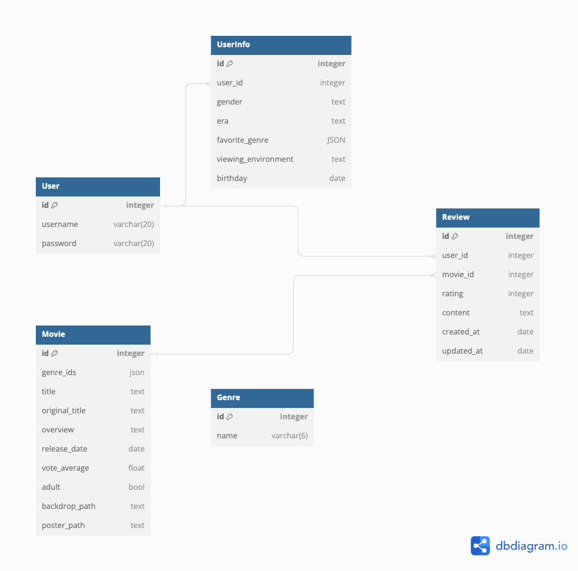

# 10-pjt

SSAFY 11기 1학기 최종 관통 프로젝트

## 주제

영화 추천 알고리즘 기반 커뮤니티 서비스

## 프로젝트 개요

- 영화 데이터 기반 추천 웹 서비스 개발
- 영화 추천 알고리즘 구현
- 커뮤니티 서비스 구성
- 서비스 관리 및 유지보수

## 팀원 정보 및 업무 분담 내역

- 팀장 : 장지현
  - 기획, Front-End, Design
- 팀원 : 이찬규
  - 기획, Back-End

## 목표 서비스 구현 및 실제 구현 정도

### 목표 서비스

1. (기본) 사용자 데이터 입력을 통한 영화 추천
2. (중심) **<u>기념일</u>** 데이터에 따른 영화 추천
3. (추가) 영화관 정보
   ⇒ 접근성, 영화에 적합한 환경 (사운드가 중요한 영화(음악), 영화관 규모(아담한, 단란한) 등)

### 실제 구현 정도

1. (기본) 사용자 데이터 입력을 바탕으로 한 영화 추천 기능 구현 완료
2. (중심) **<u>기념일</u>** 데이터 기반으로 매일 다른 영화를 추천

### 구현 과정

#### 필수 요구사항

- 영화 데이터
  - 최소 50개 이상 데이터
  - fixtures로 load 가능한 데이터
- 영화 추천 알고리즘
  - 사용자가 최소 1개 이상의 영화 추천받을 수 있음
- API
- 커뮤니티
  - "소통"이라는 관점 안에서 다양한 방법으로 구현
- README
- 최소 5개 이상 URL 및 페이지 구성
- (DRF) 적절한 HTTP response status code 응답

#### 컨셉

- 프로젝트 컨셉 :

  코로나 이후 영화 시장은 급격하게 변화하였습니다. 극장에서의 영화 관람에 어려움이 생기면서 전세계적으로 OTT 시장이 급격하게 성장하였습니다. 이러한 추세는 코로나 이후에도 이어져 실제 작년 영화 관람객 수가 코로나 이전의 절반 수준이라고 합니다.

  그럼에도 불구하고 여전히 영화관이 망하지 않는 이유는 영화관이 단순히 영화를 관람하는 기능에 더해서 소중한 사람들과 함께 시간과 공간, 나아가 추억을 공유하는 역할을 수행하기 때문이라고 생각합니다.

  저희 팀은 영화관의 이러한 역할에 기인하여 다양한 기념일 정보를 수집하고 이를 바탕으로 매일매일 서로 다른 영화를 추천해주는 웹페이지를 구성하였습니다.

  매일매일을 기념일처럼 보내시라는 의미에서 서비스 명을 MovieRing으로 정하였고, 디자인을 깔끔한 검은색 바탕에 설레는 분홍색 계열을 조합하여 구성했습니다. 이용자분들이 부디 우리 페이지를 통해 매일매일을 의미있고 즐겁게 보내기를 바랍니다.

### 구현 정도

#### 1. API를 통해 데이터 불러오기

- TMDB API를 이용하여 top_rated 영화 목록과 영화 장르 정보를 가져와 데이터베이스에 저장했습니다.

#### 2. 인증과 권한 기능 구현

- 회원가입/로그인/로그아웃 기능을 구현하고 로그인되어 있는 사용자만이 사용자 데이터를 입력하고 영화 리뷰를 작성할 수 있도록 하였습니다.

#### 3. 사용자 데이터를 입력받고 데이터베이스에 저장

- 사용자의 영화 취향에 대한 정보를 입력받고 해당 정보를 데이터베이스에 저장할 수 있도록 했습니다.

#### 4. 영화 데이터를 랜더링

- 영화 데이터들을 일정한 기준(장르, 인기도, 개봉 연도 등)으로 필터링하여 그 목록을 출력하도록 하였습니다.
- 해당 영화의 이미지를 클릭하면 세부 정보를 표시하는 페이지로 이동하도록 하였습니다.

#### 5. 추천 영화를 렌더링

- 영화 추천은 크게 두 가지 갈래로 나뉩니다. 개인이 입력한 사용자 입력 데이터를 기반으로 한 영화 추천과 오늘에 해당하는 기념일을 기반으로 한 영화 추천입니다.

#### 6. 영화 커뮤니티 구현

- 영화의 세부 정보 페이지 하단에 영화에 대한 평점과 감상평을 남기면 그 내용을 입력 form 하단에 리뷰 목록들을 렌더링하도록 하였습니다.

## 데이터베이스 모델링 (ERD)

## 영화 추천 알고리즘에 대한 기술적 설명

1. 사용자 데이터 기반 추천

- 사용자 입력 데이터를 객체 형태로 저장
- movies.json data를 순회하면서 원하는 조건의 key-value 값 연결
- 해당 movie를 새로 정의된 배열 movielist_filtered에 push
- filter된 리스트를 순회하며 vue-setup 위에 추천 영화 리스트 띄우기

2. 기념일 기반 추천

- 1년(365일) 매일 사회적으로 정의된 기념일 더미 데이터 생성(.json)
- 영화 추천 데이터 추가 생성 : AI(ChatGPT) 활용 - 해당 기념일 이름으로 유추되는 키워드와 연관 장르, 그와 유사한 영화 리스트 3개 생성 요청
- 새로 생성된 데이터와 오늘 날짜를 연결해서 추천 영화 리스트 띄우기

* Today's Movie 결정(영화 3개 중 무작위로 1개 선택)

## 핵심 기능에 대한 설명

1. Recommend

- TMDB API 활용 : TopRated Movie List .json 파일로 추출
- AI 활용 : 기념일 별 키워드, 연관성 높은 영화 판단 맡김
- 로그인 된 유저의 입력 데이터 장고 DB에서 불러옴 - userinfoDetail에 props로 넘겨줌 - 함수로 처리

2. User Account

- Django Rest Framework 사용
- 회원가입 / 로그인 / 로그아웃 구현 - localStorage authToken 저장/삭제하는 방식
- store에 user 저장, user & Token 존재 확인하면서 로그인 상태 유지

3. Community
- axios를 활용하여 django의 데이터베이스와 view 함수와 연결
- 영화 상세 페이지 하단에 ReviewView 페이지를 랜더링 하고 이 페이지에서 form을 통해 POST 요청으로 영화 리뷰를 작성하여 Django의 데이터베이스에 저장
- Vue의 Store에서 함수를 정의하고 onMounted로 이 함수를 호출하여 해당 영화에 해당하는 리뷰들을 GET 요청으로 화면 하단에 렌더링함

## 후기

### 지현

    느낀점
      전공이 전공인지라 늘 처음부터 끝까지 혼자 기획하고 구상하고 해내는 일을 해왔는데, 페어와 단 둘이 합을 맞춰 작업을 진행하는 일이 생각보다 까다롭게 느껴졌다. 평소 즐겨했던 창작, 기획 의도와 아이디어 설정 등 초반 outline을 짜는 데에는 익숙했지만 'IT 프로젝트'에 관해서는 경험이 많은게 아니다보니 일주일이라는 시간을 두고 우리가 실현해낼수 있는 지점이 어디인지 파악이 되지 않아 중간중간 많이 지쳤던 것 같다.
      그래도 늘, 어떤 일이든 지나고 나면 배울 점만 남는다. 처음 욕심냈던 우리의 컨셉과 기능이 너무 복합적이어서 우리의 역량을 벗어난다고 판단될 때 더 작은 블록으로 나눠가면서 해결하는 과정이 꽤 효율적으로 흘러갔고 또 충분히 재미있었다. 영화 데이터 다루는 게 막막했을 때 페어가 온전히 데이터 처리를 담당해줘서 그 외의 기능 구현에 집중할 수 있었고, 내가 부족한 부분을 페어와 공유하며 서로 보완하는 법을 배웠다. 물론 단순 오타 이슈로 발생한 에러가 정말 많았고, 평소처럼 명확한 구현 과제를 따라가는 실습이 아닌 하나하나 과정을 꾸려가면서 만들어야 하는 작업을 진행하는 게 쉽지 않았지만 뭐든 여러 번 경험해보고 익숙해지면 될 일인 것 같다는 생각이 든다. 그래도 백엔드는 못하겠음. 여러모로 좋은 경험이었다 !

### 찬규

    느낀점
      프로젝트를 시작하기 전에는 걱정이 앞섰다. 어떤 사람과 페어를 이루게 될지 처음 마주한 IT 분야에서 온전한 결과물을 낼 수 있을지 등등이 머릿 속을 가득채웠다. 
      강사님께서 프로젝트를 시작하기 전, 기획의 중요성을 강조해주셨다. 올바른 지도와 목적지를 가진 사람이 무작정 빨리 출발한 사람보다 목적지에 더 빨리 도착할 수 있는 것과 같은 원리였다. 페어가 된 지현 누나가 방향을 잘 잡아주고 계속해서 소통하려고 노력해준 덕분에 나도 조금씩 용기를 내서 입을 열고 처음 기획, 설계 단계를 재밌게 이어나갈 수 있었다. 
      영화 추천 서비스를 설계하며 그동안 이용자의 입장에만 있었던 내가 개발자의 입장에서 이용자들이 어떤 것을 원하고 좋아할지를 고민하고 있다는 사실이 재밌었다. 수업 시간에 배웠던 이론과 코드들이 어떤 상황에서 어떻게 적용되는지, 이용자의 입장에서는 이를 어떻게 느낄지 고민해보고 알아가는 과정이었다. 개발은 개발자의 실현 가능성과 이용자의 욕구를 절충해가는 과정이라는 생각이 들었다. 또한 재밌고 창의적인 그리고 실용적인 아이디어에는 이를 확실히 구현할 수 있는 경험과 기술적 역량이 항상 상호보완적으로 따라가야한다는 것도 느낄 수 있었다.
      인간과 인간이 작업하는 것이기에 소통 (남의 말을 잘 듣고 나의 의견을 잘 이해할 수 있는 능력)도 중요하다는 생각이 들었다. 처음에는 백과 프론트로 역할을 나눴지만 종내는 작은 기능별로 역할을 쪼개어 각자가 맡게 되었는데 내가 맡은 기능에서 내가 막히기 시작하니까 뭔가 내 상황을 공유하기가 부끄럽고 자존심 상하는 순간이 있었다. 하지만, 혼자만 해결하려고 하기보다는 함께 이야기를 나누고 문제점을 찾아보는게 훠어어얼씬 효율적이고 현명한 방법이라는 것을 알고 있었다. 
      프론트를 맡은 누나의 주도적인 디자인을 보면서 보기 좋은 떡이 먹기도 좋다는 옛말이 떠올랐다. UI, UX 이런 이야기를 많이 하는데 어떻게 이 온라인 세상에서 조금이라도 더 사람들이 편안하고 행복할 수 있을까 고민해가는 과정이라는 생각이 들었다.
      첫 프로젝트인 만큼 탈도 많고 할말도 정말 많다. 이제 웹 개발의 세계에 첫 발을 디뎠다. 다양한 경험을 하고 더 많은 것을 배우고 싶다. 언젠가 내가 외친 것처럼 따뜻한 개발자가 되고 싶다. 그런 따뜻한 개발자로 남기 위해 앞으로도 계속해서 누구보다 냉철하게 배우고 익히고 경험하고 성장해나갈 것이다.
